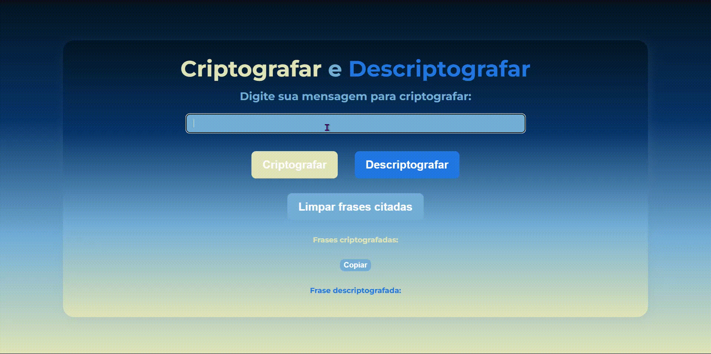

<h1 align="center">

</h1>

<h1 align="center">
  
</h1>

Este é um projeto simples para criptografar e descriptografar mensagens usando o algoritmo de CriptoJS. O projeto permite que você insira uma mensagem, criptografe-a, e então copie ou descriptografe a mensagem criptografada.

## Índice

- [Decodificador de Mensagens](#decodificador-de-mensagens)
  - [Índice](#índice)
  - [Como Usar](#como-usar)
    - [Criptografar uma Mensagem](#criptografar-uma-mensagem)
    - [Descriptografar uma Mensagem](#descriptografar-uma-mensagem)
    - [Copiar a Última Mensagem Criptografada](#copiar-a-última-mensagem-criptografada)
    - [Limpar Frases Citadas](#limpar-frases-citadas)
    - [Atalhos de Teclado](#atalhos-de-teclado)

## Como Usar

### Criptografar uma Mensagem

1. Digite sua mensagem no campo de entrada.
2. Clique no botão "Criptografar".
3. A mensagem criptografada será adicionada à lista de frases criptografadas.

### Descriptografar uma Mensagem

1. Digite a mensagem criptografada no campo de entrada.
2. Clique no botão "Descriptografar".
3. A mensagem descriptografada será exibida abaixo.

### Copiar a Última Mensagem Criptografada

1. Clique no botão "Copiar".
2. A última mensagem criptografada será copiada para a área de transferência.

### Limpar Frases Citadas

1. Clique no botão "Limpar frases citadas".
2. Todas as frases criptografadas serão removidas da lista.

### Atalhos de Teclado

- **Enter**: Criptografa a mensagem inserida.
- **Delete**: Limpa todas as frases citadas.

  
<h1 align="center">

</h1>

